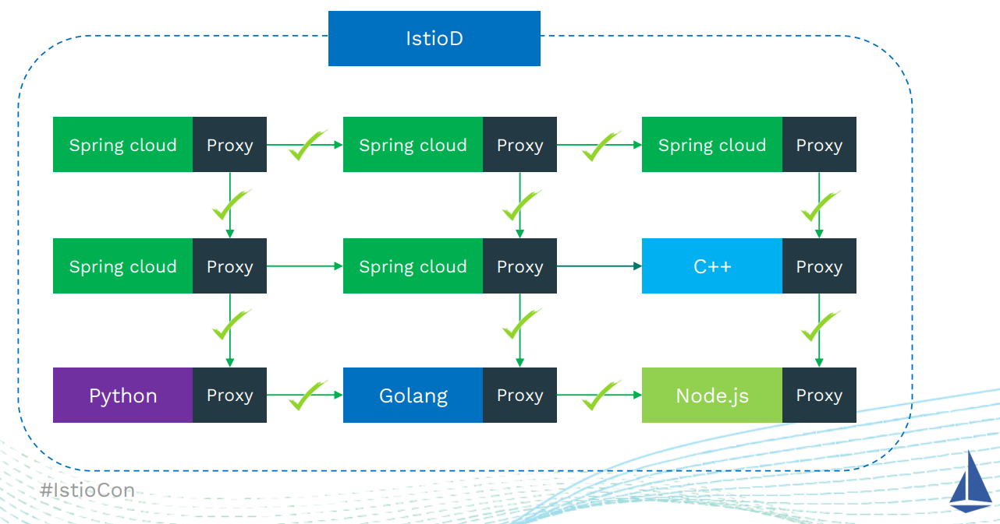
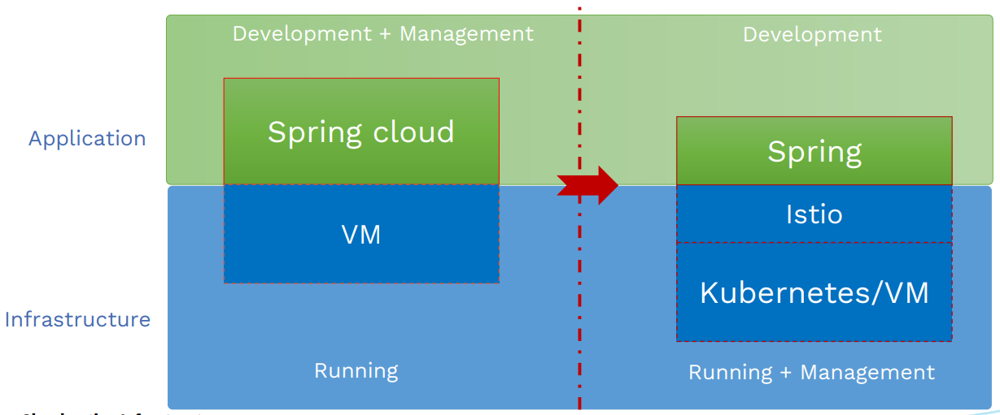
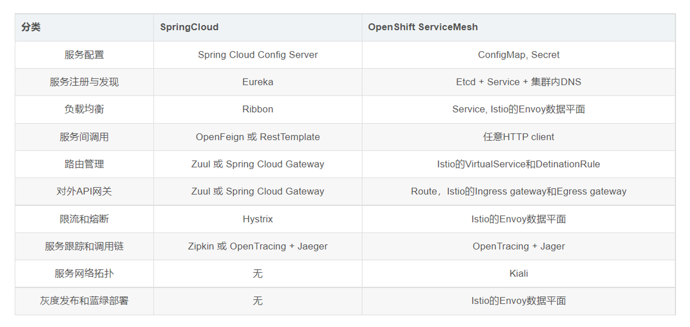
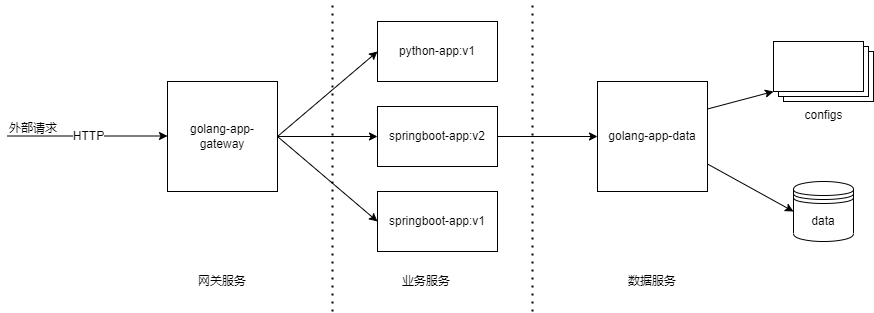
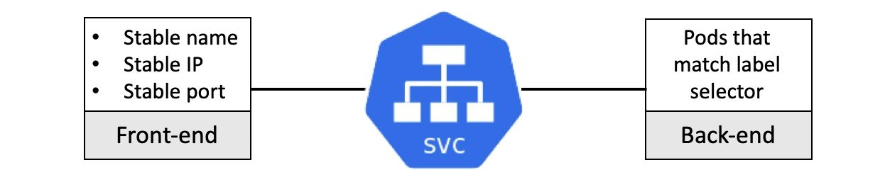
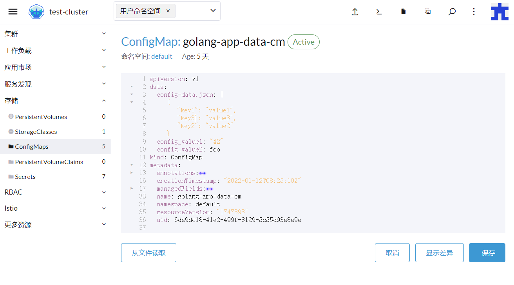
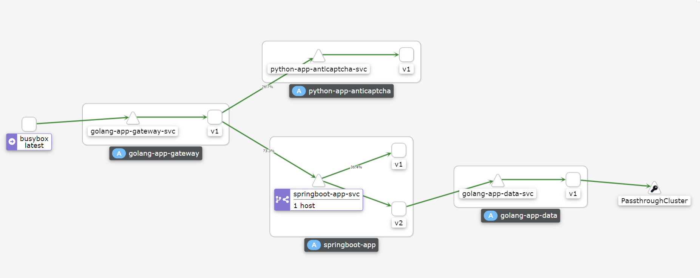
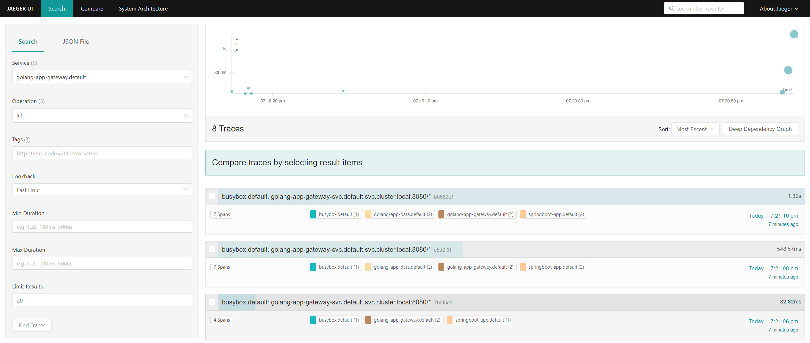
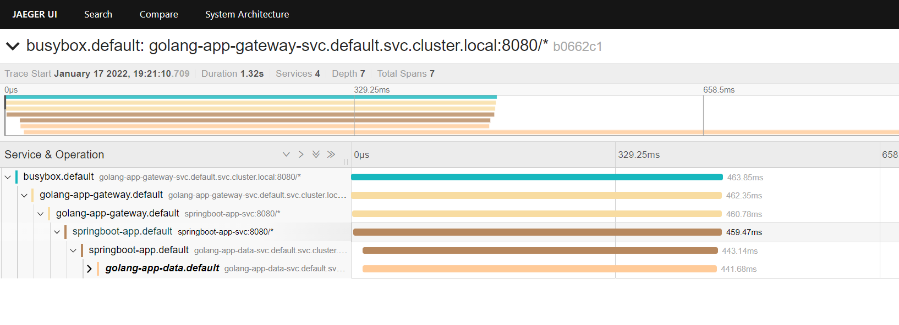
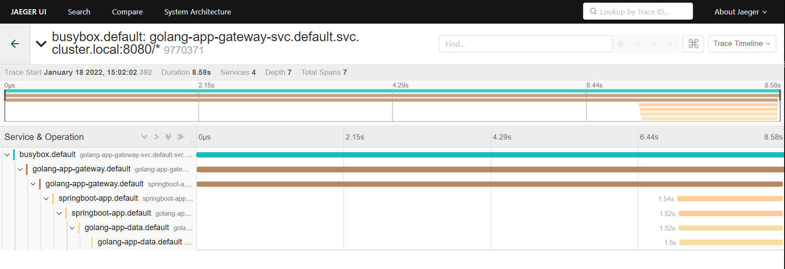

# 多语言微服务网格化方案

## 服务网格简介

服务网格（Service Mesh）是处理服务间通信的基础设施层。它负责构成现代云原生应用程序的复杂服务拓扑来可靠地交付请求。在实践中，Service Mesh 通常以轻量级网络代理阵列的形式实现，这些代理与应用程序代码部署在一起，对应用程序来说无需感知代理的存在。



如果用一句话来解释什么是 Service Mesh，可以将它比作是应用程序或者说微服务间的 TCP/IP，负责服务之间的网络调用、限流、熔断和监控。对于编写应用程序来说一般无须关心 TCP/IP 这一层（比如通过 HTTP 协议的 RESTful 应用），同样使用 Service Mesh 也就无须关心服务之间的那些原本通过服务框架实现的事情，比如 Spring Cloud、Netflix OSS 和其他中间件，现在只要交给 Service Mesh 就可以了。

## 既有方案比较

对于微服务治理，微服务SDK曾经是一个常用的解决方案。SDK形态中Spring cloud是最有影响力的代表项目。Spring cloud提供了构建分布式应用的开发工具集，大部分开发者熟知的是微服务相关项目，如：服务注册发现eureka、配置管理 config、负载均衡ribbon、熔断容错Hystrix、调用链埋点sleuth、网关zuul或Spring cloud gateway等项目。

在K8S的场景下使用传统微服务框架，会碰到一些问题：

1）多语言问题

在云原生场景下，业务一般更加复杂多样，很多时候会需要非Java体系的组件处理业务，这时这些微服务想要接入到原有的体系中非常困难。

2）将Spring cloud的微服务运行在K8s上会有很大的概率出现服务发现不及时

Spring cloud服务发现是基于各个微服务先向注册中心进行服务注册的数据来实现的，在传统Spring cloud场景下，当微服务部署在VM上，服务动态变化要求没有那么高，顶多个别实例运行不正常，通过服务发现的健康检查就足够了。但是在k8s场景下，服务实例动态迁移是非常正常场景。当业务集群规模扩大时，问题会更明显。

3）升级所有应用以应对服务管理需求变化

第三个问题是一个比较典型的问题。当有一个公共团队专门维护了一套基于Spring cloud的自有开发框架或SDK时，在每次升级开发框架时，不得不需要业务团队配合来做整体的升级。经常会SDK自身修改测试工作量不大，但却要制定很长周期的升级计划，来对数量众多的基于这个SDK开发的服务分组重新编译，打包，升级，由于业务自身没有什么改动，考虑到这个升级带来的工作量和线上风险，通常导致基础框架的升级会非常困难。

4）从单体式架构向微服务架构迁移

这是一个比较普遍的问题，就是渐进的微服务化。如何能从业务上将一个大的业务分割，解耦，然后逐步微服务化。但是站在开发者的角度讲渐进的微服务不是一个容易的事情。以基于Spring cloud框架进行微服务开发为例，为了所有的微服务间进行统一的服务发现、负载均衡，消费和执行同样的治理策略，必须要求所有的微服务基于同样的，甚至是统一版本的SDK来开发。想要独立演化的微服务比较困难。

而服务网格则通过另一种形态提供治理能力。不同于SDK方式，服务治理的能力在一个独立的代理进程中提供，完全和开发解耦。前者是一个开发框架，而后者是一个与业务无关的基础化设施。而网格形态中，最有影响力的项目当属Istio。


对于以上几个问题，引入Isito可以很大程度的解决，因为基于服务网格，业务和治理的数据面无需运行在同一个进程里，也无需一起编译，因此也没有语言和框架上的绑定。无论什么语言开发的服务，只要有一个对外可以被访问和管理的一定应用协议上的端口，都可以被网格进行管理。通过统一的网格控制面，下发统一的治理规则给统一的网格数据面执行，进行统一的治理动作，包括前面介绍到的灰度、流量、安全、可观察性等等。



## 基于Istio的微服务方案

Istio 是一个开源服务网格，它透明地分层到现有的分布式应用程序上。 Istio 强大的特性提供了一种统一和更有效的方式来保护、连接和监视服务。 Istio 是实现负载平衡、服务到服务身份验证和监视的路径——只需要很少或不需要更改服务代码。它强大的控制平面带来了重要的特点，包括：

- 使用 TLS 加密、强身份认证和授权的集群内服务到服务的安全通信
- 自动负载均衡的 HTTP, gRPC, WebSocket，和 TCP 流量
- 通过丰富的路由规则、重试、故障转移和故障注入对流量行为进行细粒度控制
- 一个可插入的策略层和配置 API，支持访问控制、速率限制和配额
- 对集群内的所有流量(包括集群入口和出口)进行自动度量、日志和跟踪

下表对比了典型的Spring Cloud应用迁移到ServiceMesh后实现微服务的区别：



### 示例项目

本次会使用一个由4个微服务组成的项目示例，通过模拟网关、微服务层、数据层进行互相调用等业务场景，来展示服务网格的各项能力。



其中：

- golang-app-data 是一个简单的模拟数据访问的服务，会根据配置文件或其他数据源返回数据作为响应

- springboot-app 是业务层的java springboot服务，其中v1版本会返回固定的响应，v2版本会通过调用golang-app-data服务获取数据，简单包裹加工后再返回给调用方

- python-app-anticaptcha 是机器学习相关的python验证码应用服务

- golang-app-gateway 是业务网关模拟服务，会根据配置访问不同服务以及springboot-app的不同版本

#### 项目结构

示例项目中，各部分内容的说明：

```bash
istio-poc/
├── artifacts
│   ├── apps                     # 示例服务定义yaml文件
│   └── sample                   # istio功能演示资源对象yaml文件
├── docs
├── istio-1.12.1                 # istio可执行文件和配置文件等
├── src                          # 示例服务源码和打包目录
│   ├── golang-app-data
│   ├── golang-app-gateway
│   ├── springboot-app-v1
│   └── springboot-app-v2
└── up-istio.sh                  # 用于下载istio和setup集群的脚本
```

#### 基础集群搭建说明

本次演示使用minikube搭建k8s集群，minikube是一种轻量级的 Kubernetes 实现和方便在本地搭建集群的工具，便于再现集群情况和定位问题等。

使用版本 v1.24.0 或更高，以及 minikube 的 kvm driver（或者docker driver）

istio和相关组件需要至少8Gb的内存，以 16384 MB 内存和 4 CPUs 启动 minikube。

```bash
minikube start --memory=16384 --cpus=4
```

在集群启动后，执行 minikube status，确认控制平面已经正确启动，说明集群状态正常

```bash
$ minikube status
minikube
type: Control Plane
host: Running
kubelet: Running
apiserver: Running
kubeconfig: Configured

$ kubectl cluster-info
Kubernetes control plane is running at https://192.168.49.2:8443
CoreDNS is running at https://192.168.49.2:8443/api/v1/namespaces/kube-system/services/kube-dns:dns/proxy

To further debug and diagnose cluster problems, use 'kubectl cluster-info dump'.
```

如果希望minikube提供一个对外的负载均衡器，可以另外执行：

```bash
minikube tunnel --cleanup
```

##### Istio部署

安装istio有3种方法，分别为 `使用 Istioctl 安装`, `使用 Istio Operator 安装`, `使用 Helm 安装`

后面两种还不是很成熟，我们这里使用 `istioctl` 工具来安装和管理istio集群

```bash

# 下载istio，本次测试使用1.12.1版本

curl -L https://istio.io/downloadIstio | ISTIO_VERSION=1.12.1 TARGET_ARCH=x86_64 sh -
cd istio-1.12.1
export PATH=$PWD/bin:$PATH

istioctl install --set profile=demo -y

# 为default namespace开启自动sidecar注入，这样default中的所有pod会被istio网格自动管理
kubectl label namespace default istio-injection=enabled

# 安装web ui等插件，并等待完成
kubectl apply -f samples/addons
kubectl rollout status deployment/kiali -n istio-system
istioctl analyze

# analyze 无问题后确认istio svc状态正常，
# 主要是确认 istio-ingressgateway的EXTERNAL-IP是否已经正确配置

kubectl get svc -n istio-system
NAME                   TYPE           CLUSTER-IP       EXTERNAL-IP      PORT(S)                                                                      AGE
grafana                ClusterIP      10.108.188.235   <none>           3000/TCP                                                                     13d
istio-egressgateway    ClusterIP      10.100.106.177   <none>           80/TCP,443/TCP                                                               13d
istio-ingressgateway   LoadBalancer   10.110.124.236   10.110.124.236   15021:32621/TCP,80:30047/TCP,443:31077/TCP,31400:30753/TCP,15443:30434/TCP   13d
istiod                 ClusterIP      10.106.12.227    <none>           15010/TCP,15012/TCP,443/TCP,15014/TCP                                        13d
jaeger-collector       ClusterIP      10.105.108.119   <none>           14268/TCP,14250/TCP,9411/TCP                                                 13d
kiali                  LoadBalancer   10.96.101.18     10.96.101.18     20001:31440/TCP,9090:30377/TCP                                               13d
prometheus             ClusterIP      10.108.148.57    <none>           9090/TCP                                                                     13d
tracing                ClusterIP      10.102.132.183   <none>           80/TCP,16685/TCP                                                             13d
zipkin                 ClusterIP      10.106.228.48    <none>           9411/TCP                                                                     13d

```

另外通过nginx为web服务设置代理

##### 配置好的集群web入口

集群管理  rancher webui   https://172.29.40.28:1443/  admin/adminadminadmin

服务可视化 kiali webui    http://172.29.40.28:20001/

调用链追踪 jaeger webui   http://172.29.40.28:20002/

##### 基础环境配置

```bash
kubectl apply -f artifacts/apps
```

等待服务接口可用

```bash
$ kubectl get svc -o wide
NAME                         TYPE        CLUSTER-IP       EXTERNAL-IP   PORT(S)    AGE     SELECTOR
golang-app-data-svc          ClusterIP   10.104.75.178    <none>        8080/TCP   5d21h   app=golang-app-data
golang-app-gateway-svc       ClusterIP   10.97.154.142    <none>        8080/TCP   6d20h   app=golang-app-gateway
httpbin                      ClusterIP   10.96.99.135     <none>        8000/TCP   7d22h   app=httpbin
kubernetes                   ClusterIP   10.96.0.1        <none>        443/TCP    13d     <none>
python-app-anticaptcha-svc   ClusterIP   10.106.125.212   <none>        8080/TCP   18h     app=python-app-anticaptcha
springboot-app-svc           ClusterIP   10.100.59.122    <none>        8080/TCP   6d2h    app=springboot-app
```

等待服务接口可用，启动一个测试容器访问最前端的gateway服务，测试服务可用性：

```bash
kubectl run busybox --image=wardenlym/busybox -i --tty

# 由于部署了两个版本的 springboot-app, 各有50%的访问几率

## springboot-app:v1 的行为是返回一个固定字符串 "springboot app V1"

$ kubectl exec -it busybox -- curl -i golang-app-gateway-svc:8080
HTTP/1.1 200 OK
date: Tue, 18 Jan 2022 05:43:39 GMT
content-length: 68
content-type: text/plain; charset=utf-8
x-envoy-upstream-service-time: 57
server: envoy

Gateway get from upstream: [

 response from: springboot app V1

]

## springboot-app:v2 的行为是调用data服务后，返回其中的config数据

$ kubectl exec -it busybox -- curl -i golang-app-gateway-svc:8080
HTTP/1.1 200 OK
date: Tue, 18 Jan 2022 05:43:42 GMT
content-length: 171
content-type: text/plain; charset=utf-8
x-envoy-upstream-service-time: 683
server: envoy

Gateway get from upstream: [

 response from: springboot app V2, args: <data from golang-app-data: [{
  "key1": "value1",
  "key3": "value3",
  "key2": "value2"
}
] >

]

# 通过gateway访问anticaptcha服务，会返回一个验证码相关业务的json响应

kubectl exec -it golang-app-gateway-v1-68db4b469b-jql8h -- curl -X POST "http://python-app-anticaptcha-svc:8080/anticaptcha/yk122" -H "accept: application/json" -H "Content-Type: multipart/form-data" -F "img=@math.jfif;type=image/jpeg"

{"data":5,"message":"Success!","state":"000"}

```

### 微服务各功能实现

#### 服务发现

Service 是 Kubernetes 中 DNS-Based 的原生服务发现，是可以将运行在一组 Pods 上的应用程序公开为网络服务的通用方法。Service会为一组 Pod 提供相同的 DNS 名，并且可以在它们之间进行基础的简单负载均衡。

通过Service不需要像传统框架的服务注册来进行发现，而是需要预定义资源对象来创建服务名，之后相应选择器筛选到的 Pod 可用时，Kubernetes会自动为服务填入 Endpoint

##### 定义 Service

```yaml
apiVersion: v1
kind: Service
metadata:
  name: golang-app-gateway-svc     # service元信息
  labels:
    app: golang-app-gateway
    service: golang-app-gateway
spec:
  ports:
  - port: 8080                     # 协议和端口
    name: http
  selector:
    app: golang-app-gateway        # Pod选择器
```

上述配置创建一个名称为 "golang-app-gateway-svc" 的 Service 对象，它会将请求代理到使用 HTTP 端口 8080 "app=golang-app-gateway" 的 Pod 上。

各调用方可以依赖定义的 Service 名 + 端口号 进行调用

```bash
kubectl exec -it busybox -- curl golang-app-gateway-svc:8080
Gateway get from upstream: [

 response from: springboot app V1

]

```

##### 外部命名服务

当需要方位外部服务时，可以定义 ExternalName 类型的服务，将外部service映射，例如：

```yaml
kind: Service
apiVersion: v1
metadata:
  name: my-db-service
  namespace: prod
spec:
  type: ExternalName
  externalName: my.database.example.com
  ports:
  - port: 3306
```

当没有任何可用的后端服务时，访问service的行为会获得503错误

```bash
kubectl scale --replicas=0 deployment golang-app-gateway-v1
deployment.apps/golang-app-gateway-v1 scaled

kubectl exec -it busybox -- curl -i golang-app-gateway-svc:8080
HTTP/1.1 503 Service Unavailable
content-length: 19
content-type: text/plain
date: Mon, 17 Jan 2022 06:48:43 GMT
server: envoy
```

可以把 Kubernetes Service 理解为前端和后端两部分：

前端：名称、IP 和端口等不变的部分。
后端：符合特定标签选择条件的 Pod 集合。
前端是稳定可靠的，它的名称、IP 和端口在 Service 的整个生命周期中都不会改变，也没有客户端的 DNS 缓存超时等问题。



Service在默认情况下会使用 RoundRobin 或 SessionAffinity 的方式为后端服务进行简单的负载均衡

这里的负载均衡是一个简单的 4 层轮询。它工作在连接层面，所以对于 7 层的 HTTP 头或者 Cookie 等是无法感知的。

后续介绍的Istio会通过扩展的VirtualService类型，可以在Service功能的基础上进行各种7层可感知的流量管理

#### 配置中心

ConfigMap 是一种Kubernetes原生用于配置的资源对象，

有3种语言无关的方式来使用 ConfigMap 配置 Pod 中的容器：

1. 在容器命令和参数内
2. 容器的环境变量
3. 映射在卷里面添加为文件，供应用来读取

另外springboot还提供了将configmap中的字段映射为springboot的configuration的插件

作为环境变量挂载的Configmap无法热更新，因为是在Pod启动的时候，作为环境变量注入到Pod环境中的，所以需要重启工作负载。适合用于一些不需要热更的配置参数等。

挂载为文件卷的Configmap可以进行秒级别的热更新，当Configmap中内容改变时，几秒内容器中的文件也会进行响应的变化。适合大部分情况的配置文件

如果应用设计上在读取后缓存了配置文件，需要手动重启pod或者使用reload自动重启应用

##### 定义Configmap

```yaml
apiVersion: v1
kind: ConfigMap
metadata:
  name: golang-app-data-cm
data:
  config_value1: "42"            # 类属性键；每一个键都映射到一个简单的值
  config_value2: "foo"
  config-data.json: |            # 类文件键, 内容方便作为文件（支持换行等）
    {
      "key1": "value1",
      "key2": "value2"
    }

```

##### 在应用中使用Configmap

```yaml
apiVersion: apps/v1
kind: Deployment
metadata:
  name: golang-app-data-v1
  labels:
    app: golang-app-data
    version: v1
spec:
  replicas: 1
  selector:
    matchLabels:
      app: golang-app-data
      version: v1
  template:
    metadata:
      labels:
        app: golang-app-data
        version: v1
    spec:
      containers:
      - name: golang-app-data
        image: wardenlym/golang-app-data:v1
        imagePullPolicy: IfNotPresent
        env:
          - name: CONFIG_VALUE1          # 请注意这里是要注入的环境变量名，可自定义
            valueFrom:
              configMapKeyRef:
                name: golang-app-data-cm # 这个值为 ConfigMap name
                key: config_value1       # 需要取值的键
          - name: CONFIG_VALUE2
            valueFrom:
              configMapKeyRef:
                name: golang-app-data-cm
                key: config_value2
        ports:
        - containerPort: 8080
        securityContext:
          runAsUser: 1000
        volumeMounts:
        - name: data-from-configmap
          mountPath: "/app/config"         # 映射在容器中的挂载目录
          readOnly: true                   # 可以设置挂载后为只读文件
      volumes:
        - name: data-from-configmap
          configMap:
            name: golang-app-data-cm       # config map 名称
            items:
            - key: config-data.json        # config map中的key名称
              path: config-data.json       # 映射后的文件名
```

应用configmap和deployment后，可以进入容器进行检查，可以看到配置都正确挂载了

```bash
$ kubectl exec -it golang-app-data-v1-9c99cdbdf-7g5qn -- /bin/sh
/app $ echo $CONFIG_VALUE1
42
/app $ echo $CONFIG_VALUE2
foo
/app $ cat config/config-data.json
{
  "key1": "value1",
  "key2": "value2"
}
/app $
```

##### 热更新

1. 通过RancherUI的资源对象管理功能，通过界面修改configmap的值，如增加：



也可以直接修改资源对象或用其他工具，应用成功后访问服务，可以发现请求内容发生了动态变化

```bash

/app $ cat config/config-data.json
{
  "key1": "value1",
  "key3": "value3",
  "key2": "value2"
}

$ kubectl exec -it busybox -- curl -i golang-app-gateway-svc:8080
HTTP/1.1 200 OK
date: Mon, 17 Jan 2022 09:13:39 GMT
content-length: 171
content-type: text/plain; charset=utf-8
x-envoy-upstream-service-time: 1745
server: envoy

Gateway get from upstream: [

 response from: springboot app V2, args: <data from golang-app-data: [{
  "key1": "value1",
  "key3": "value3",
  "key2": "value2"
}
] >

]

```

##### Auto Reloader

有时候应用的逻辑没有正确读取更新后的文件，需要手动重启应用。如果想简单的每次configmap更新后，都自动的重启相关的工作负载，可以使用下面这个工具：

https://github.com/stakater/Reloader

它可以监控 Configmap/Secret 的变化，根据 Annotation 选择 Deployment，对相关 Deployment 进行滚动更新。配置非常简单，只需要在deployment的定义中加入注解：

```yaml
kind: Deployment
metadata:
  annotations:
    reloader.stakater.com/search: "true"
spec:
  template:
```

不过，一般还是建议检查Configmap确定正确无误再手动重启应用，避免错误的配置被下发。

##### Secret

Secret 是一种包含少量敏感信息例如密码、令牌或密钥的对象。由于创建 Secret 可以独立于使用它们的 Pod， 因此在创建、查看和编辑 Pod 的工作流程中暴露 Secret（及其数据）的风险较小。

##### 创建 Secret

Secret有很多种类型，其中Opaque标识用户定义的任意数据，其他的type都有单独的固定格式和特殊用途，下面主要介绍Opaque类型的Secret

Secret中的data字段需要进行base64编码，不允许使用明文,例如，要使用 Secret 的 data 字段存储两个字符串，请将字符串转换为 base64 ，如下所示：

```bash
echo -n 'admin' | base64
YWRtaW4=
```

```yaml
apiVersion: v1
kind: Secret
metadata:
  name: mysecret
  namespace: default
type: Opaque
data:
  username: YWRtaW4=
  password: YWRtaW4=

```

##### 使用Secret

Secret 可以作为数据卷被挂载，或作为环境变量 暴露出来以供 Pod 中的容器使用。

```yaml
apiVersion: v1
kind: Pod
metadata:
  name: secret-pod
spec:
  containers:
  - name: secret-pod
    image: wardenlym/busybox
    env:
      - name: USERNAME
        valueFrom:
          secretKeyRef:
            name: mysecret
            key: username
      - name: PASSWORD
        valueFrom:
          secretKeyRef:
            name: mysecret
            key: password    
    volumeMounts:
    - name: foo
      mountPath: "/etc/foo"
      readOnly: true
  volumes:
  - name: foo
    secret:
      secretName: mysecret
```

之后，Secret 将被挂载到 /etc/foo 目录，可以通过文件访问内容

```bash
kubectl exec secret-pod -- ls /etc/foo
password
username

kubectl exec secret-pod -- cat /etc/foo/username
admin

kubectl exec secret-pod -- cat /etc/foo/password
admin

# 进入容器查看环境变量
kubectl exec -it secret-pod -- /bin/bash
bash-5.1# echo $USERNAME
admin
bash-5.1# echo $PASSWORD
admin
```

容器中的程序负责从文件中读取 secret, 挂载的 Secret 会被自动更新。如果某个容器已经在通过环境变量使用某 Secret，对该 Secret 的更新不会被 容器马上看见，除非容器被重启。

##### Secret 与 Configmap 使用上的差异

对于开发者使用上类似，主要是权限管理上，Configmap适合保存与业务相关的配置项等，可以跟代码一同保存在代码库里

Secret一般由运维人员维护，保存一些账号密码、auth token等类型的机密数据，开发者只通过管理员告知的secret name引用，这样可以保证数据安全。

https://kubernetes.io/zh/docs/concepts/configuration/secret/

#### 负载均衡

Istio 基本的服务发现和负载均衡能力提供了一个可用的服务网格，但它能做到的远比这多。在许多情况下，我们可能希望对网格的流量情况进行更细粒度的控制。这个时候需要通过定制虚拟服务和目标规则策略来实现。

##### 虚拟服务（Virtual Service）

虚拟服务用来配置如何在服务网格内将请求路由到服务，这基于 Istio 和平台提供的基本的连通性和服务发现能力。每个虚拟服务包含一组路由规则，Istio 按顺序评估规则，将每个给定的请求匹配到虚拟服务指定的实际目标地址。

##### 目标规则（Destination Rule）

虚拟服务将流量如何路由到给定目标地址后，将使用目标规则来配置该目标的流量。在评估虚拟服务路由规则之后，目标规则将应用于流量的“真实”目标地址。

目标规则还允许在调用整个目的地服务或特定服务子集时定制 Envoy 的流量策略，比如负载均衡模型、TLS 安全模式或熔断器设置等。

##### 权重路由

VirtualService的权重路由功能可以为服务的不同版本进行流量比例控制

运行以下命令以应用 Virtual Service后，流量会以百分之20/80的比例发送到后端服务：

```yaml
apiVersion: networking.istio.io/v1beta1
kind: VirtualService
metadata:
  labels:
    kiali_wizard: request_routing
  name: springboot-app-svc
  namespace: default
spec:
  hosts:
  - springboot-app-svc.default.svc.cluster.local
  http:
  - route:
    - destination:
        host: springboot-app-svc.default.svc.cluster.local
        subset: v1
      weight: 20
    - destination:
        host: springboot-app-svc.default.svc.cluster.local
        subset: v2
      weight: 80
```

由于配置传播是最终一致的，因此需要等待几秒钟以使 Virtual Service 生效。

在生效一段时间后，可以通过面板观察到流量比例的变化：



下面的虚拟服务根据请求是否来自特定的用户，把它们路由到服务的不同版本。

```yaml
apiVersion: networking.istio.io/v1alpha3
kind: VirtualService
metadata:
  name: reviews
spec:
  hosts:
  - reviews
  http:
  - match:
    - headers:                 # 根据7层头内容进行路由负载
        end-user:
          exact: jason
    route:
    - destination:
        host: reviews
        subset: v2
  - route:
    - destination:
        host: reviews
        subset: v3

```

默认情况下，Istio 使用轮询的负载均衡策略，实例池中的每个实例依次获取请求。Istio 同时支持如下的负载均衡模型，可以在 DestinationRule 中为流向某个特定服务或服务子集的流量指定这些模型。

loadBalancer的每种类型中还有具体的子类型供选择，基本涵盖了大部分场景：

```bash
类型

simple                   在简单类型中，可以选择的有：
                         ROUND_ROBIN    默认选项
                         LEAST_CONN     使用一个O(1)的算法选择具有最小活动连接的主机
                         RANDOM         完全随机，如果没有配置健康检查策略，随机负载均衡器的性能通常比轮询更好
                         PASSTHROUGH    高级用例，此选项会将连接转发到调用者请求的原始 IP 地址，而不进行任何形式的负载平衡

consistentHash           一致性哈希类型：
                         httpHeaderName 基于特定 HTTP 标头的散列
                         httpCookie     基于 HTTP cookie 的哈希
                         useSourceIp    基于源 IP 地址的哈希
                         minimumRingSize 高级选项，用于哈希环的最小虚拟节点数。默认为 1024。较大的环尺寸会导致更精细的负载分布。

localityLbSetting       与跨机房的负载均衡相关的选项，可以指定云服务商的可用区等

```

```yaml
apiVersion: networking.istio.io/v1alpha3
kind: DestinationRule
metadata:
  name: my-destination-rule
spec:
  host: my-svc
  trafficPolicy:                     # 对于整个服务的每个版本使用随机策略
    loadBalancer:
      simple: RANDOM
  subsets:
  - name: v1
    labels:
      version: v1
  - name: v2
    labels:
      version: v2
    trafficPolicy:
      loadBalancer:                  # 对于v2版本使用轮询策略
        simple: ROUND_ROBIN
  - name: v3
    labels:
      version: v3
    trafficPolicy:
      loadBalancer:
        consistentHash:              # 对于v3版本使用基于cookie的一致性哈希算法
          httpCookie:
            name: user
            ttl: 0s

```

#### 调用链追踪

分布式追踪通过监控流经网格的单个请求，提供了一种监控和理解行为的方法。代理自动为其应用程序生成追踪 span，只需要应用程序转发适当的请求上下文即可。

Isito是可以接入符合Opentracing标准的追踪组件，支持很多追踪系统，包括 Zipkin、Jaeger、LightStep、Datadog等。

对于最常用的3中分布式链路追踪组件，在关键指标进行对比上：


可以看出，Zipkin 和 Jaeger 在各个方面都差不多，Jaeger 是在 Zipkin 的基础上改进了 Web UI 和传输协议等方面且支持更多的客户端语言。SkyWalking 相对前面两种组件来说，功能较为齐全，虽然也支持多种语言的客户端，但接入其他语言同样需要侵入sdk。

综合比较现在比较常用的是Jaeger，接入Jaeger可以追踪使网格的运维人员能够理解服务的依赖关系以及在服务网格中的延迟源。

##### 追踪上下文传递

尽管 Istio 代理能够自动发送 Span，但是他们需要一些附加线索才能将整个追踪链路关联到一起。所以当代理发送 span 信息的时候，应用需要附加适当的 HTTP 请求头信息，这样才能够把多个 Span 正确的关联到同一个追踪上。

要做到这一点，应用程序从传入请求到任何传出的请求中需要包含以下请求头参数：

```bash
x-request-id
x-b3-traceid
x-b3-spanid
x-b3-parentspanid
x-b3-sampled
x-b3-flags
x-ot-span-context
```

通过Jaeger面板可以查看到到调用链路，在左边选择Service，或者在顶部输入TraceID查询



在右边点击对应的span，可以看到详细的调用过程，其中显示了每一层调用链的耗时情况



通过gateway调用服务

```bash
kubectl exec -it golang-app-gateway-v1-68db4b469b-jql8h -- curl -X POST "http://python-app-anticaptcha-svc:8080/anticaptcha/yk122" -H "accept: application/json" -H "Content-Type: multipart/form-data" -F "img=@math.jfif;type=image/jpeg"
```

#### 流控熔断

熔断（Circuit Breaker），原是指当电流超过规定值时断开电路，进行短路保护或严重过载保护的机制。后来熔断也广泛应用于金融领域，指当股指波幅达到规定的熔断点时，交易所为控制风险采取的暂停交易措施。而在软件系统领域，熔断则是指当服务到达系统负载阈值时，为避免整个软件系统不可用，而采取的一种主动保护措施。

对于微服务系统而言，熔断尤为重要，它可以使系统在遭遇某些模块故障时，通过服务降级等方式来提高系统核心功能的可用性，得以应对来自故障、潜在峰值或其他未知网络因素的影响。

##### 创建测试客户端

首先，创建 fortio 实例,创建客户端程序以发送流量到 gateway 服务。这是一个名为 Fortio 的负载测试客户端，它可以控制连接数、并发数及发送 HTTP 请求的延迟。通过 Fortio 能够有效的触发前面在 DestinationRule 中设置的熔断策略。它起初是 Istio 项目的一部分，现已独立进行运营。

```bash
$ kubectl apply -f samples/httpbin/sample-client/fortio-deploy.yaml
```

获取 fortio pod 名：

```bash
$ export FORTIO_POD=$(kubectl get pods -l app=fortio -o 'jsonpath={.items[0].metadata.name}')
$ echo $FORTIO_POD
```
登入客户端 Pod 并使用 Fortio 工具调用 httpbin 服务。-curl 参数表明发送一次调用：

```bash
$ kubectl exec "$FORTIO_POD" -c fortio -- /usr/bin/fortio curl -quiet http://golang-app-gateway-svc:8080
HTTP/1.1 200 OK
date: Tue, 18 Jan 2022 06:18:19 GMT
content-length: 68
content-type: text/plain; charset=utf-8
x-envoy-upstream-service-time: 84
server: envoy

Gateway get from upstream: [

 response from: springboot app V1

]
```

##### 触发熔断规则

熔断和流控功能，也是由 Destination Rule 中的 TrafficPolicy 来控制，主要使用 outlierDetection 和 connectionPool 两个选项：

```yaml
apiVersion: networking.istio.io/v1alpha3
kind: DestinationRule
metadata:
  name: golang-app-gateway-dr
spec:
  host: golang-app-gateway-svc
  trafficPolicy:
    connectionPool:
      tcp:
        maxConnections: 1                        # 将连接池大小设为1
      http:
        http1MaxPendingRequests: 1               # 将http连接池大小设为1
        maxRequestsPerConnection: 1              # 与gateway的 request/PerConnection 不超过1个
    outlierDetection:
      consecutive5xxErrors: 1                    # 任何连续 1 次失败并出现 502、503 或 504 错误代码的主机
      interval: 5m                               # 将被弹出 5 分钟。默认为 10 秒
      interval: 1s                               # 上游主机配置为每 1 秒扫描一次
      baseEjectionTime: 3m                       # 最短拒绝时间默认为 30 秒。
      maxEjectionPercent: 100                    # 上游服务的负载平衡池中可以拒绝的主机的最大百分比。默认为 10%。

      # minHealthPercent                         只要关联的负载平衡池在健康模式下至少具有最小健康百分比的主机，就会启用异常值检测。
                                                   #默认值为 0%，因为它通常不适用于每个服务的 pod 很少的 k8s 环境。
```

更多详细参数： https://istio.io/latest/docs/reference/config/networking/destination-rule/#OutlierDetection

在之前的 DestinationRule 配置中，我们定义了 maxConnections: 1 和 http1MaxPendingRequests: 1。这些规则意味着，如果并发的连接和请求数超过一个，在 istio-proxy 进行进一步的请求和连接时，后续请求或连接将被阻止。

发送并发数为 3 的连接（-c 3），请求 30 次（-n 30）：

```bash
$ kubectl exec "$FORTIO_POD" -c fortio -- /usr/bin/fortio load -c 3 -qps 0 -n 30 -loglevel Warning http://golang-app-gateway-svc:8080
06:22:35 I logger.go:127> Log level is now 3 Warning (was 2 Info)
Fortio 1.17.1 running at 0 queries per second, 64->64 procs, for 30 calls: http://golang-app-gateway-svc:8080
Starting at max qps with 3 thread(s) [gomax 64] for exactly 30 calls (10 per thread + 0)
Ended after 4.602739033s : 30 calls. qps=6.5179
Aggregated Function Time : count 30 avg 0.27845043 +/- 0.5766 min 0.000629317 max 2.237552815 sum 8.35351294
# range, mid point, percentile, count
>= 0.000629317 <= 0.001 , 0.000814658 , 26.67, 8
> 0.001 <= 0.002 , 0.0015 , 46.67, 6
> 0.002 <= 0.003 , 0.0025 , 56.67, 3
> 0.007 <= 0.008 , 0.0075 , 60.00, 1
> 0.009 <= 0.01 , 0.0095 , 63.33, 1
> 0.01 <= 0.011 , 0.0105 , 66.67, 1
> 0.012 <= 0.014 , 0.013 , 70.00, 1
> 0.3 <= 0.35 , 0.325 , 73.33, 1
> 0.45 <= 0.5 , 0.475 , 80.00, 2
> 0.5 <= 0.6 , 0.55 , 90.00, 3
> 0.9 <= 1 , 0.95 , 93.33, 1
> 2 <= 2.23755 , 2.11878 , 100.00, 2
# target 50% 0.00233333
# target 75% 0.4625
# target 90% 0.6
# target 99% 2.20192
# target 99.9% 2.23399
Sockets used: 19 (for perfect keepalive, would be 3)
Jitter: false
Code 200 : 13 (43.3 %)
Code 503 : 17 (56.7 %)
Response Header Sizes : count 30 avg 72.866667 +/- 83.33 min 0 max 170 sum 2186
Response Body/Total Sizes : count 30 avg 262.93333 +/- 42.74 min 234 max 341 sum 7888
All done 30 calls (plus 0 warmup) 278.450 ms avg, 6.5 qps
```

可以看到预期的熔断行为，只有 43.3% 的请求成功，其余的均被熔断器拦截，在请求数少的情况下有一定误差

```bash
kubectl exec "$FORTIO_POD" -c istio-proxy -- pilot-agent request GET stats | grep golang-app-gateway | grep pending
cluster.outbound|8080||golang-app-gateway-svc.default.svc.cluster.local.circuit_breakers.default.remaining_pending: 1
cluster.outbound|8080||golang-app-gateway-svc.default.svc.cluster.local.circuit_breakers.default.rq_pending_open: 0
cluster.outbound|8080||golang-app-gateway-svc.default.svc.cluster.local.circuit_breakers.high.rq_pending_open: 0
cluster.outbound|8080||golang-app-gateway-svc.default.svc.cluster.local.upstream_rq_pending_active: 0
cluster.outbound|8080||golang-app-gateway-svc.default.svc.cluster.local.upstream_rq_pending_failure_eject: 0
cluster.outbound|8080||golang-app-gateway-svc.default.svc.cluster.local.upstream_rq_pending_overflow: 186
cluster.outbound|8080||golang-app-gateway-svc.default.svc.cluster.local.upstream_rq_pending_total: 266
```

可以看到 upstream_rq_pending_overflow 值，表示了目前为止已有多少个调用被标记为熔断。

#### 其他网格高级功能

服务网格带来了更多的支持能力，对于更好的微服务控制力、可观察性、安全性等方面具有诸多优点

##### 故障注入

注入故障可以用于测试应用程序的弹性和稳定性，与其他错误注入机制（如延迟数据包或在网络层杀掉 Pod）不同，Istio 允许在应用层注入错误。这使您可以注入更多相关的故障，例如 HTTP 错误码和基于Header的情况分析等，以获得更多相关的结果。

下面这个示例，将给 springboot-app 微服务为测试用户 jason 引入一个 HTTP abort。

```yaml
apiVersion: networking.istio.io/v1beta1
kind: VirtualService
metadata:
  labels:
    kiali_wizard: request_routing
  name: springboot-app-svc
  namespace: default
spec:
  hosts:
  - springboot-app-svc.default.svc.cluster.local
  http:
  - fault:
      abort:
        httpStatus: 500   # 用于中止 Http 请求的 HTTP 状态代码 可以使用4xx、5xx等
        percentage:       # 使用提供的错误代码中止请求的百分比，可以选择注入一定比例的错误
          value: 100      # 百分比指定 [0.0, 100.0] 范围内的百分比
    match:                # 此次故障注入限制为仅影响header标识的用户 jason。如果您以任何其他用户身份登录，则不会遇到任何延迟。
    - headers:
        end-user:
          exact: jason
    route:
    - destination:
        host: springboot-app-svc.default.svc.cluster.local
        subset: v1
  - route:
    - destination:
        host: springboot-app-svc.default.svc.cluster.local
        subset: v2
```

测试验证行为：

```bash
# 使用jason用户访问，会发生错误
kubectl exec -it busybox -- curl -i -H "end-user:jason" springboot-app-svc:8080
HTTP/1.1 500 Internal Server Error
content-length: 18
content-type: text/plain
date: Tue, 18 Jan 2022 07:26:46 GMT
server: envoy

fault filter abort

# 使用其他用户身份访问正常
kubectl exec -it busybox -- curl -i springboot-app-svc:8080
HTTP/1.1 200 OK
content-type: text/plain;charset=UTF-8
content-length: 136
date: Tue, 18 Jan 2022 07:27:33 GMT
x-envoy-upstream-service-time: 772
server: envoy

response from: springboot app V2, args: <data from golang-app-data: [{
  "key1": "value1",
  "key3": "value3",
  "key2": "value2"
}
] >
```

https://istio.io/latest/zh/docs/reference/config/networking/virtual-service/#HTTPFaultInjection-Abort

##### 延迟注入

延迟注入可以对时间故障模拟，模拟网络延迟很高或一个超载的上游服务的行为。

```yaml
apiVersion: networking.istio.io/v1beta1
kind: VirtualService
metadata:
  labels:
    kiali_wizard: request_routing
  name: springboot-app-svc
  namespace: default
spec:
  hosts:
  - springboot-app-svc.default.svc.cluster.local
  http:
  - fault:
      delay:
        fixedDelay: 7s               # 在转发请求之前添加一个固定的延迟。格式：1h/1m/1s/1ms。必须 >=1 毫秒
        percentage:                  # 将被注入延迟的请求的百分比
          value: 100
    # match:                         # 此次故障注入限制为仅影响header标识的用户 jason。如果您以任何其他用户身份登录，则不会遇到任何延迟。
    # - headers:
    #     end-user:
    #       exact: jason
    route:
    - destination:
        host: springboot-app-svc.default.svc.cluster.local
        subset: v2
```

从jaeger ui上可以比较直观的看到，这次调用在gateway发起出，延迟了大约6秒左右：



https://istio.io/latest/zh/docs/reference/config/networking/virtual-service/#HTTPFaultInjection-Delay

##### 流量镜像

流量镜像，也称为影子流量或流量拷贝，是一个以尽可能低的风险为生产带来变化的强大的功能。镜像会将实时流量的副本发送到镜像服务。镜像流量发生在主服务的关键请求路径之外。

```yaml
apiVersion: networking.istio.io/v1alpha3
kind: VirtualService
metadata:
  name: springboot-app-svc
spec:
  hosts:
    - springboot-app-svc.default.svc.cluster.local
  http:
  - route:
    - destination:
        host: springboot-app-svc.default.svc.cluster.local
        subset: v1
      weight: 100                 # 注意，与流量负载均衡不同，这时只有一个destination，v1版本确实会收到100%的所有的请求
    mirror:
      host: springboot-app-svc.default.svc.cluster.local
      subset: v2                  # 但是，同时istio会将请求的一定比例，镜像的发往v2版本中
    mirrorPercent: 10             # 将 10% 的请求发往 v2 版本服务
```

## SpirngCloud体系兼容性

这部分调研一些关于Istio与现有springcloud体系中各组件交叉支持的调研

很多springcloud中的开源组件都通过插件或中间件的形式支持了与istio集成，后续可以根据实际需要进一步深入考察

### SpringCloud集成扩展

spring-cloud-kubernetes plugin

#### opentrancing 集成

springboot opentracing-sdk

#### nacos istio插件集成

nacos istio plugin

#### skywalking-go支持

为go项目引入skywalking sdk

##### Spring集成k8s配置的相关资料

https://access.redhat.com/documentation/en-us/red_hat_fuse/7.5/html/fuse_on_openshift_guide/integrate-spring-boot-with-kubernetes
https://docs.spring.io/spring-cloud-kubernetes/docs/current/reference/html/
https://cloud.tencent.com/developer/article/1679044
https://blog.csdn.net/boling_cavalry/article/details/95804909
https://github.com/redhat-developer-demos/spring-boot-configmaps-demo
https://developers.redhat.com/blog/2017/10/03/configuring-spring-boot-kubernetes-configmap#setup
