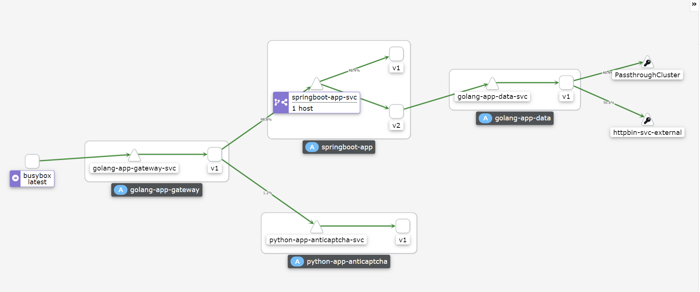
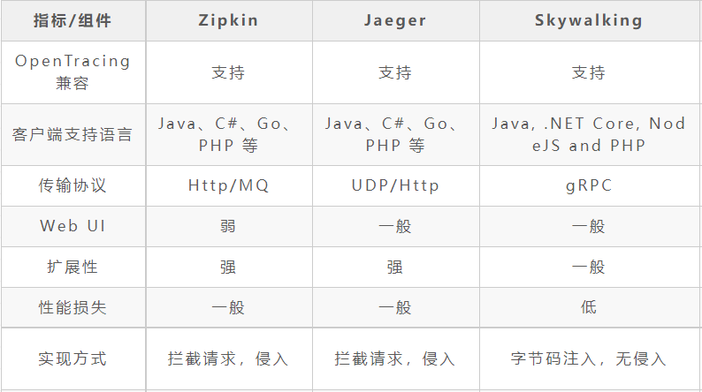

# 多语言微服务网格化方案

## 服务网格简介

$讲服务网格的废话

## 既有方案比较

$找华为那个ppt里的废话加上去$

$就说网格和springcloud

springcloud-to-istio.png


$比较各个istio的组件

下表对比了典型的Spring Cloud应用迁移到ServiceMesh后实现微服务的区别：


## 基于Istio的微服务方案

$讲istio的废话

### 示例项目

本次会使用一个由4个微服务组成的项目示例，通过模拟网关、微服务层、数据层进行互相调用等业务场景，来展示服务网格的各项能力。


其中：

- golang-app-data 是一个简单的模拟数据访问的服务，会根据配置文件或其他数据源返回数据作为响应

- springboot-app 是业务层的java springboot服务，其中v1版本会返回固定的响应，v2版本会通过调用golang-app-data服务获取数据，简单包裹加工后再返回给调用方

- python-app-anticaptcha 是机器学习相关的python验证码应用服务

- golang-app-gateway 是业务网关模拟服务，会根据配置访问不同服务以及springboot-app的不同版本

#### 项目结构

示例项目中，各部分内容的说明：

```bash
istio-poc/
├── artifacts
│   ├── apps                     # 示例服务定义yaml文件
│   └── sample                   # istio功能演示资源对象yaml文件
├── docs
├── istio-1.12.1                 # istio可执行文件和配置文件等
├── src                          # 示例服务源码和打包目录
│   ├── golang-app-data
│   ├── golang-app-gateway
│   ├── springboot-app-v1
│   └── springboot-app-v2
└── up-istio.sh                  # 用于下载istio和setup集群的脚本
```

#### 基础设施搭建说明

$这里放讲minikube的废话

##### 集群配置

$这里讲一下配置集群参数的废话，有就找一些linux的参数，k8s的参数啥的凑数，反正也没人能看懂

##### Istio部署

$复制粘贴istio文档上部署bookinfo的废话

配置好的集群web入口：

集群管理  rancher webui   https://172.29.40.28:1443/  admin/adminadminadmin

服务可视化 kiali webui    http://172.29.40.28:20001/

调用链追踪 jaeger webui   http://172.29.40.28:20002/

##### 基础环境配置

各种apply -f
最后curl一下，看下结果

### 微服务各功能实现

#### 服务发现

Service 是 Kubernetes 中 DNS-Based 的原生服务发现，是可以将运行在一组 Pods 上的应用程序公开为网络服务的通用方法。Service会为一组 Pod 提供相同的 DNS 名，并且可以在它们之间进行基础的简单负载均衡。

通过Service不需要像传统框架的服务注册来进行发现，而是需要预定义资源对象来创建服务名，之后相应选择器筛选到的 Pod 可用时，Kubernetes会自动为服务填入 Endpoint

##### 定义 Service

```yaml
apiVersion: v1
kind: Service
metadata:
  name: golang-app-gateway-svc     # service元信息
  labels:
    app: golang-app-gateway
    service: golang-app-gateway
spec:
  ports:
  - port: 8080                     # 协议和端口
    name: http
  selector:
    app: golang-app-gateway        # Pod选择器
```

上述配置创建一个名称为 "golang-app-gateway-svc" 的 Service 对象，它会将请求代理到使用 HTTP 端口 8080 "app=golang-app-gateway" 的 Pod 上。

各调用方可以依赖定义的 Service 名 + 端口号 进行调用

```bash
kubectl exec -it busybox -- curl golang-app-gateway-svc:8080
Gateway get from upstream: [

 response from: springboot app V1

]

```

##### 外部命名服务

当需要方位外部服务时，可以定义 ExternalName 类型的服务，将外部service映射，例如：

```yaml
kind: Service
apiVersion: v1
metadata:
  name: my-db-service
  namespace: prod
spec:
  type: ExternalName
  externalName: my.database.example.com
  ports:
  - port: 3306
```

当没有任何可用的后端服务时，访问service的行为会获得503错误

```bash
kubectl scale --replicas=0 deployment golang-app-gateway-v1
deployment.apps/golang-app-gateway-v1 scaled

kubectl exec -it busybox -- curl -i golang-app-gateway-svc:8080
HTTP/1.1 503 Service Unavailable
content-length: 19
content-type: text/plain
date: Mon, 17 Jan 2022 06:48:43 GMT
server: envoy
```

可以把 Kubernetes Service 理解为前端和后端两部分：

前端：名称、IP 和端口等不变的部分。
后端：符合特定标签选择条件的 Pod 集合。
前端是稳定可靠的，它的名称、IP 和端口在 Service 的整个生命周期中都不会改变，也没有客户端的 DNS 缓存超时等问题。


Service在默认情况下会使用 RoundRobin 或 SessionAffinity 的方式为后端服务进行简单的负载均衡

这里的负载均衡是一个简单的 4 层轮询。它工作在连接层面，所以对于 7 层的 HTTP 头或者 Cookie 等是无法感知的。

后续介绍的Istio会通过扩展的VirtualService类型，可以在Service功能的基础上进行各种7层可感知的流量管理

#### 配置中心

ConfigMap 是一种Kubernetes原生用于配置的资源对象，

有3种语言无关的方式来使用 ConfigMap 配置 Pod 中的容器：

1. 在容器命令和参数内
2. 容器的环境变量
3. 映射在卷里面添加为文件，供应用来读取

另外springboot还提供了将configmap中的字段映射为springboot的configuration的插件

作为环境变量挂载的Configmap无法热更新，因为是在Pod启动的时候，作为环境变量注入到Pod环境中的，所以需要重启工作负载。适合用于一些不需要热更的配置参数等。

挂载为文件卷的Configmap可以进行秒级别的热更新，当Configmap中内容改变时，几秒内容器中的文件也会进行响应的变化。适合大部分情况的配置文件

如果应用设计上在读取后缓存了配置文件，需要手动重启pod或者使用reload自动重启应用

##### 定义Configmap

```yaml
apiVersion: v1
kind: ConfigMap
metadata:
  name: golang-app-data-cm
data:
  config_value1: "42"            # 类属性键；每一个键都映射到一个简单的值
  config_value2: "foo"
  config-data.json: |            # 类文件键, 内容方便作为文件（支持换行等）
    {
      "key1": "value1",
      "key2": "value2"
    }

```

##### 在应用中使用Configmap

```yaml
apiVersion: apps/v1
kind: Deployment
metadata:
  name: golang-app-data-v1
  labels:
    app: golang-app-data
    version: v1
spec:
  replicas: 1
  selector:
    matchLabels:
      app: golang-app-data
      version: v1
  template:
    metadata:
      labels:
        app: golang-app-data
        version: v1
    spec:
      containers:
      - name: golang-app-data
        image: wardenlym/golang-app-data:v1
        imagePullPolicy: IfNotPresent
        env:
          - name: CONFIG_VALUE1          # 请注意这里是要注入的环境变量名，可自定义
            valueFrom:
              configMapKeyRef:
                name: golang-app-data-cm # 这个值为 ConfigMap name
                key: config_value1       # 需要取值的键
          - name: CONFIG_VALUE2
            valueFrom:
              configMapKeyRef:
                name: golang-app-data-cm
                key: config_value2
        ports:
        - containerPort: 8080
        securityContext:
          runAsUser: 1000
        volumeMounts:
        - name: data-from-configmap
          mountPath: "/app/config"         # 映射在容器中的挂载目录
          readOnly: true                   # 可以设置挂载后为只读文件
      volumes:
        - name: data-from-configmap
          configMap:
            name: golang-app-data-cm       # config map 名称
            items:
            - key: config-data.json        # config map中的key名称
              path: config-data.json       # 映射后的文件名
```

应用configmap和deployment后，可以进入容器进行检查，可以看到配置都正确挂载了

```bash
$ kubectl exec -it golang-app-data-v1-9c99cdbdf-7g5qn -- /bin/sh
/app $ echo $CONFIG_VALUE1
42
/app $ echo $CONFIG_VALUE2
foo
/app $ cat config/config-data.json
{
  "key1": "value1",
  "key2": "value2"
}
/app $
```

##### 热更新

1. 通过RancherUI的资源对象管理功能，通过界面修改configmap的值，如增加：


也可以直接修改资源对象或用其他工具，应用成功后访问服务，可以发现请求内容发生了动态变化

```bash

/app $ cat config/config-data.json
{
  "key1": "value1",
  "key3": "value3",
  "key2": "value2"
}

$ kubectl exec -it busybox -- curl -i golang-app-gateway-svc:8080
HTTP/1.1 200 OK
date: Mon, 17 Jan 2022 09:13:39 GMT
content-length: 171
content-type: text/plain; charset=utf-8
x-envoy-upstream-service-time: 1745
server: envoy

Gateway get from upstream: [

 response from: springboot app V2, args: <data from golang-app-data: [{
  "key1": "value1",
  "key3": "value3",
  "key2": "value2"
}
] >

]

```

##### Auto Reloader

有时候应用的逻辑没有正确读取更新后的文件，需要手动重启应用。如果想简单的每次configmap更新后，都自动的重启相关的工作负载，可以使用下面这个工具：

https://github.com/stakater/Reloader

它可以监控 Configmap/Secret 的变化，根据 Annotation 选择 Deployment，对相关 Deployment 进行滚动更新。配置非常简单，只需要在deployment的定义中加入注解：

```yaml
kind: Deployment
metadata:
  annotations:
    reloader.stakater.com/search: "true"
spec:
  template:
```

不过，一般还是建议检查Configmap确定正确无误再手动重启应用，避免错误的配置被下发。

##### Secret

https://kubernetes.io/zh/docs/concepts/configuration/secret/

##### Spring集成k8s配置的相关资料

https://access.redhat.com/documentation/en-us/red_hat_fuse/7.5/html/fuse_on_openshift_guide/integrate-spring-boot-with-kubernetes
https://docs.spring.io/spring-cloud-kubernetes/docs/current/reference/html/
https://cloud.tencent.com/developer/article/1679044
https://blog.csdn.net/boling_cavalry/article/details/95804909
https://github.com/redhat-developer-demos/spring-boot-configmaps-demo
https://developers.redhat.com/blog/2017/10/03/configuring-spring-boot-kubernetes-configmap#setup

#### 负载均衡

Istio 基本的服务发现和负载均衡能力提供了一个可用的服务网格，但它能做到的远比这多。在许多情况下，我们可能希望对网格的流量情况进行更细粒度的控制。这个时候需要通过定制虚拟服务和目标规则策略来实现。

##### 虚拟服务（Virtual Service）

虚拟服务用来配置如何在服务网格内将请求路由到服务，这基于 Istio 和平台提供的基本的连通性和服务发现能力。每个虚拟服务包含一组路由规则，Istio 按顺序评估规则，将每个给定的请求匹配到虚拟服务指定的实际目标地址。

##### 目标规则（Destination Rule）

虚拟服务将流量如何路由到给定目标地址后，将使用目标规则来配置该目标的流量。在评估虚拟服务路由规则之后，目标规则将应用于流量的“真实”目标地址。

目标规则还允许在调用整个目的地服务或特定服务子集时定制 Envoy 的流量策略，比如负载均衡模型、TLS 安全模式或熔断器设置等。

##### 权重路由

VirtualService的权重路由功能可以为服务的不同版本进行流量比例控制

运行以下命令以应用 Virtual Service后，流量会以百分之20/80的比例发送到后端服务：

```yaml
apiVersion: networking.istio.io/v1beta1
kind: VirtualService
metadata:
  labels:
    kiali_wizard: request_routing
  name: springboot-app-svc
  namespace: default
spec:
  hosts:
  - springboot-app-svc.default.svc.cluster.local
  http:
  - route:
    - destination:
        host: springboot-app-svc.default.svc.cluster.local
        subset: v1
      weight: 20
    - destination:
        host: springboot-app-svc.default.svc.cluster.local
        subset: v2
      weight: 80
```

由于配置传播是最终一致的，因此需要等待几秒钟以使 Virtual Service 生效。

在生效一段时间后，可以通过面板观察到流量比例的变化：



下面的虚拟服务根据请求是否来自特定的用户，把它们路由到服务的不同版本。

```yaml
apiVersion: networking.istio.io/v1alpha3
kind: VirtualService
metadata:
  name: reviews
spec:
  hosts:
  - reviews
  http:
  - match:
    - headers:                 # 根据7层头内容进行路由负载
        end-user:
          exact: jason
    route:
    - destination:
        host: reviews
        subset: v2
  - route:
    - destination:
        host: reviews
        subset: v3

```

默认情况下，Istio 使用轮询的负载均衡策略，实例池中的每个实例依次获取请求。Istio 同时支持如下的负载均衡模型，可以在 DestinationRule 中为流向某个特定服务或服务子集的流量指定这些模型。

loadBalancer的每种类型中还有具体的子类型供选择，基本涵盖了大部分场景：

```bash
类型

simple                   在简单类型中，可以选择的有：
                         ROUND_ROBIN    默认选项
                         LEAST_CONN     使用一个O(1)的算法选择具有最小活动连接的主机
                         RANDOM         完全随机，如果没有配置健康检查策略，随机负载均衡器的性能通常比轮询更好
                         PASSTHROUGH    高级用例，此选项会将连接转发到调用者请求的原始 IP 地址，而不进行任何形式的负载平衡

consistentHash           一致性哈希类型：
                         httpHeaderName 基于特定 HTTP 标头的散列
                         httpCookie     基于 HTTP cookie 的哈希
                         useSourceIp    基于源 IP 地址的哈希
                         minimumRingSize 高级选项，用于哈希环的最小虚拟节点数。默认为 1024。较大的环尺寸会导致更精细的负载分布。

localityLbSetting       与跨机房的负载均衡相关的选项，可以指定云服务商的可用区等

```

```yaml
apiVersion: networking.istio.io/v1alpha3
kind: DestinationRule
metadata:
  name: my-destination-rule
spec:
  host: my-svc
  trafficPolicy:                     # 对于整个服务的每个版本使用随机策略
    loadBalancer:
      simple: RANDOM
  subsets:
  - name: v1
    labels:
      version: v1
  - name: v2
    labels:
      version: v2
    trafficPolicy:
      loadBalancer:                  # 对于v2版本使用轮询策略
        simple: ROUND_ROBIN
  - name: v3
    labels:
      version: v3
    trafficPolicy:
      loadBalancer:
        consistentHash:              # 对于v3版本使用基于cookie的一致性哈希算法
          httpCookie:
            name: user
            ttl: 0s

```

#### 调用链追踪

分布式追踪通过监控流经网格的单个请求，提供了一种监控和理解行为的方法。代理自动为其应用程序生成追踪 span，只需要应用程序转发适当的请求上下文即可。

Isito是可以接入符合Opentracing标准的追踪组件，支持很多追踪系统，包括 Zipkin、Jaeger、LightStep、Datadog等。

对于最常用的3中分布式链路追踪组件，在关键指标进行对比上：



可以看出，Zipkin 和 Jaeger 在各个方面都差不多，Jaeger 是在 Zipkin 的基础上改进了 Web UI 和传输协议等方面且支持更多的客户端语言。SkyWalking 相对前面两种组件来说，功能较为齐全，虽然也支持多种语言的客户端，但接入其他语言同样需要侵入sdk。

综合比较现在比较常用的是Jaeger，接入Jaeger可以追踪使网格的运维人员能够理解服务的依赖关系以及在服务网格中的延迟源。

##### 追踪上下文传递

尽管 Istio 代理能够自动发送 Span，但是他们需要一些附加线索才能将整个追踪链路关联到一起。所以当代理发送 span 信息的时候，应用需要附加适当的 HTTP 请求头信息，这样才能够把多个 Span 正确的关联到同一个追踪上。

要做到这一点，应用程序从传入请求到任何传出的请求中需要包含以下请求头参数：

```bash
x-request-id
x-b3-traceid
x-b3-spanid
x-b3-parentspanid
x-b3-sampled
x-b3-flags
x-ot-span-context
```

通过Jaeger面板可以查看到到调用链路，在左边选择Service，或者在顶部输入TraceID查询


在右边点击对应的span，可以看到详细的调用过程，其中显示了每一层调用链的耗时情况


通过gateway调用服务

```bash
kubectl exec -it golang-app-gateway-v1-68db4b469b-jql8h -- curl -X POST "http://python-app-anticaptcha-svc:8080/anticaptcha/yk122" -H "accept: application/json" -H "Content-Type: multipart/form-data" -F "img=@math.jfif;type=image/jpeg"
```

#### 流控熔断

sample/httpbin 熔断改成 gateway

#### 其他网格高级功能

服务网格带来了更多的支持能力，对于更好的微服务控制力、可观察性、安全性等方面具有诸多优点

##### 故障注入

503注入

##### 延迟注入

delay10秒注入

##### 流量镜像

http-v2

##### TCP 流量转移

什么几把tcp-echo:v2啥的

## 其他

这部分介绍一些关于Istio与现有springcloud体系中各组件交叉支持的调研

很多springcloud中的开源组件都通过插件或中间件的形式支持了与istio集成，后续可以根据实际需要进一步深入考察

### SpringCloud集成扩展

spring cloud 接入istio需要做什么？

#### opentrancing 集成

opentracing那个sdk

#### nacos istio插件集成

nacos istio？？？

#### skywalking-go支持

golang项目skywalking golang支持
